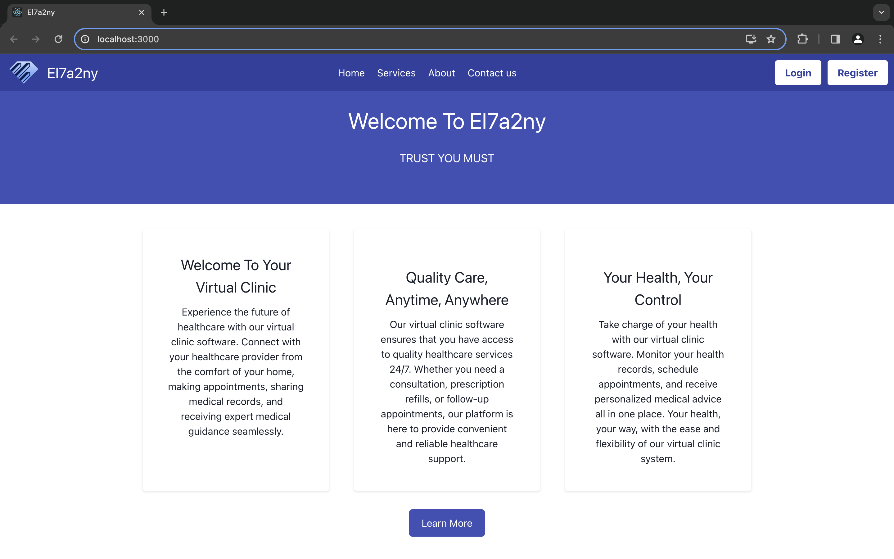
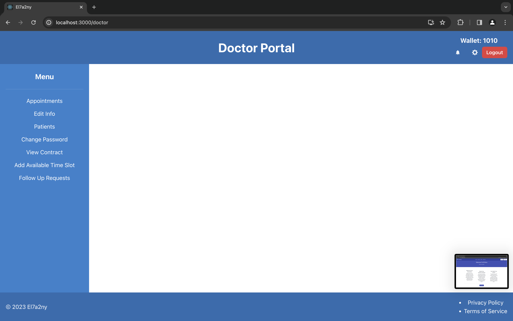

# El7a2ny

## Motivation

The motivation behind "El7a2ny" is simple: to provide easy and quick access to healthcare services through a virtual clinic and pharmacy. This project addresses the need for convenient and efficient medical care in today's fast-paced world, making healthcare more accessible to everyone, everywhere.

## Build Status

All sprints have been complete and all user requirements are satisfied. No known issues as of now.

## Code Style

Our project adheres to clean code principles, emphasizing readability and maintainability. We follow the MERN stack style guide and best practices, ensuring that our code is consistent and well-documented. This approach not only makes our codebase more approachable for future contributors but also streamlines the process of debugging and enhancing the application. We encourage contributions that align with these standards, as it helps us maintain a high-quality and professional codebase.

## Screenshots





## Tech/Framework Used

- Node.js
- MongoDB
- Express.
- React.

## Features

- Book doctor appointments online and manage them flexibly.
- Connect with doctors virtually using video and chat technologies.
- Manage medicines and prescriptions.
- Chat with pharmacists.
- View pharmacy statistics.

## Code Examples

This is a backend api point to pay for a prescription using the patients wallet, other api backend points are similar to this.

```
const payPrescriptionWallet = async (req, res) => {
  // console.log(req.body.package);
  try {
    const token = req.cookies.token;
    if (!token) {
      return res.status(401).send("Access denied. No token provided.");
    }

    const decoded = jwt.verify(token, process.env.ACCESS_TOKEN_SECRET);
    const username = decoded.username;

    const patient = await patientModel.findOne({ username });
    if (!patient) {
      return res.status(404).send("Patient not found");
    }

    if (patient.wallet < 1000) {
      return res.status(400).send("Insufficient funds");
    }

    patient.wallet -= 1000;
    await patient.save();

    res.json({ message: "Payment successful" });
  } catch (error) {
    console.error(error);
    res.status(500).send("Internal Server Error");
  }
};
```

## Installation

1. Simply clone this repository.
2. Run npm install in both backend and frontend folders.
3. Run the front end server using npm run start, and run the backend server using node app.js.
4. Then connect to localhost:3000.

## API References

app.get("/userRole", getUserRole);

app.post("/admin/add-admin", addAdmin);
app.get("/admin/admin-list", getAdmins);
app.post("/admin/remove-admin", removeAdmin);
app.get("/admin/patient-list", getPatients);
app.post("/admin/remove-patient", removePatient);
app.get("/admin/doctor-list", getDoctors);
app.post("/admin/remove-doctor", removeDoctor);
app.get("/admin/request-list", getRequests);
app.post("/admin/accept-request", acceptRequest);
app.post("/admin/remove-request", removeRequest);
app.get("/admin/packages", getPackages);
app.post("/admin/add-package", addPackage);
app.post("/admin/update-package", updatePackage);
app.post("/admin/delete-package", deletePackage);

app.post("/patient/add-family-member", addFamilyMember);
app.post("/patient/link-family-member", linkFamilyMember);
app.post("/patient/family-member-list", getFamilyMembers);
app.post("/patient/prescription-list", getPrescriptions);
app.post("/patient/appointment-list", getAppointments);
app.post("/patient/doctor-list", getDoctorsFiltered);
app.post(
  "/patient/health-records-upload",
  upload.array("files"),
  uploadHealthRecords
);
app.post("/patient/get-health-records", getHealthRecords);
app.post("/patient/getFile", getFile);
app.get("/patient/get-wallet", getWalletP);
app.post("/patient/schedule-appointment", scheduleAppointment);
app.get("/patient/packages", getPackages);
app.get("/patient/package-info", getSubscriptionInfo);
app.post("/patient/subcribe-package-wallet", subscribePackageWallet);
app.post("/patient/cancel-subscription", cancelSubscription);
app.post("/patient/create-checkout-session", createCheckoutSession);
app.post(
  "/patient/create-checkout-session-appointment",
  createCheckoutSessionAppointment
);

app.post("/doctor/edit", modifyDoctor);
app.post("/doctor/patient-list", getPatientsFiltered);
app.get("/doctor/get-wallet", getWalletD);
app.get("/doctor/follow-up-list", getFollowUpRequests);
app.post("/doctor/accept-contract", acceptContract);
app.post("/doctor/add-available-time-slot", addAvailableTimeSlot);
app.post("/doctor/schedule-followup", scheduleFollowUp);
app.post(
  "/doctor/upload-health-record-for-patient",
  upload.array("files"),
  uploadHealthRecords
);
app.post("/doctor/accept-follow-up", acceptFollowUpRequest);
app.post("/doctor/reject-follow-up", rejectFollowUpRequest);

app.post("/appointment/cancel-appointment", cancelAppointment);
app.post("/appointment/approve-appointment", approveAppointment);
app.post("/appointment/reschedule-appointment", rescheduleAppointment);
app.post("/appointment/request-follow-up", requestFollowUp);
app.post("/appointment/update-prescription", updatePrescription);
app.post("/appointment/add-prescription", addPrescripton);
app.post("/appointment/pay-prescription-wallet", payPrescriptionWallet);

router.post('/AddAdmin/:username', verify, addAdmin);
router.post('/AddPharmacist/:username', verify, addPharmacist);
router.delete('/RemovePatientOrPharmacist/:username/:Username', verify, removePatientOrPharmacist);
router.get('/InfosOfAPharmacistRequest/:username/:Username', verify, infosOfAPharmacistRequest);
router.get('/InfosOfRequestsByPharmacist/:username', verify, infosOfRequestsByPharmacist);
router.get('/AvailableMedicinesDetailsByAdmin/:username', verify, availableMedicinesDetailsByAdmin);
router.get('/PharmacistInfo/:username/:Username', verify, pharmacistInfo);
router.get('/AllPharmacists/:username', verify, allPharmacists);
router.get('/AllPatients/:username', verify, allPatients);
router.get('/PatientInfo/:username/:Username', verify, patientInfo);
router.get('/MedicineByName/:username/:Name', verify, getMedicineByName);
router.get('/MedicineByMedicalUse/:username/:MedicalUse', verify, getMedicineByMedicalUse);
router.post('/AcceptOrRejectPharmacistRequest/:username/:Username', verify, acceptOrRejectPharmacistRequest);

// Routes of Guest
router.post('/RegisterPatient', registerPatient);
router.post('/SubmitRequestToBePharmacist', upload.fields([
    { name: 'IDDocument', maxCount: 1 },
    { name: 'PharmacyDegreeDocument', maxCount: 1 },
    { name: 'WorkingLicenseDocument', maxCount: 1 },
]), submitRequestToBePharmacist);

// Routes of Patient
router.get('/AvailableMedicinesDetailsByPatient/:Username', verify, availableMedicinesDetailsByPatient);
router.get('/MedicineByName/:Username/:Name', verify, getMedicineByName);
router.get('/MedicineByMedicalUse/:Username/:MedicalUse', verify, getMedicineByMedicalUse);
router.post('/AddAddressToPatient/:Username', verify, addAddressToPatient);
router.get('/GetPatientAddresses/:Username', verify, getPatientAddresses);
router.get('/GetOrderDetails/:Username', verify, getOrderDetails);
router.put('/CancelOrder/:orderId', verify, cancelOrder);
router.get('/viewCartItems/:Username', verify, viewCartItems);
router.delete('/removeItemFromCart/:Username/:MedicineName', verify, removeAnItemFromCart);
router.post('/addMedicineToCart/:Username/:MedicineName', verify, addMedicineToCart);
router.put('/updateQuantity/:Username/:MedicineName/:quantity', verify, updateMedicineQuantityInCart);
router.post('/checkoutOrder/:Username/:paymentMethod/:ShippingAddress', verify, checkoutOrder);
router.get('/viewAlternatives/:Username/:medicineName', verify, viewAlternatives);
router.get('/getPatientWalletAmount/:Username', verify, getPatientWalletAmount);
router.get('/getAllOrders/:Username', verify, getAllOrders);
router.get('/getMedicinesFromUnfilledPrescriptions/:Username', verify, getMedicinesFromUnfilledPrescriptions);
router.post('/addPrescriptionMedicineToCart/:Username/:MedicineName', verify, addPrescriptionMedicineToCart);


// Routes of Pharmacist
router.get('/AvailableMedicinesDetailsByPharmacist/:Username', verify, availableMedicinesDetailsByPharmacist);
router.get('/AvailableMedicinesQuantity/:Username', verify, availableMedicinesQuantity);
router.get('/MedQuantityAndSales/:Username/:Name', verify, medQuantityAndSales);
router.post('/AddMedicine/:Username', verify, upload.single('Picture'), addMedicine);
router.put('/UpdateMed/:Username/:Name', verify, upload.single('Picture'), updateMed);
router.get('/MedicineByName/:Username/:Name', verify, getMedicineByName);
router.get('/MedicineByMedicalUse/:Username/:MedicalUse', verify, getMedicineByMedicalUse);
router.post('/CheckMedicineQuantityNotification', verify, checkMedicineQuantityNotification);
router.post('/deleteNotificationIfQuantityNotZero', verify, deleteNotificationIfQuantityNotZero);
router.put('/archiveMedicine/:Username/:medicineName', verify, archiveMedicine);
router.put('/unarchiveMedicine/:Username/:medicineName', verify, unarchiveMedicine);
router.get('/viewSalesReportOnChosenMonth/:Username/:chosenMonth', verify, viewSalesReportOnChosenMonth);
router.get('/viewSalesReportOnMedicine/:Username/:medicineName', verify, viewSalesReportOnMedicine);
router.get('/viewSalesReportOnDate/:Username/:date', verify, viewSalesReportOnDate);

router.post('/CheckMedicineQuantityNotification/:Username', verify, checkMedicineQuantityNotification);
router.post('/deleteNotificationIfQuantityNotZero/:Username', verify, deleteNotificationIfQuantityNotZero);
router.get('/displayNotifications/:Username', verify, displayNotifications);
router.get('/getPharmacistWalletAmount/:Username', verify, getPharmacistWalletAmount);
router.put('/updatePharmacistSalary/:Username/:hoursWorked', verify, updatePharmacistSalary);


router.get('/GetMedicineByDoctor/:username/:Name', GetMedicineByDoctor);
router.get('/GetAllMedicines/:DoctorUsername', GetAllMedicines);

## Tests

Postman was used to call the API backend points and to test them.

## How to Use

1. Register as the appropriate role.
2. Login.
3. Feel free to then discover, the web app is self explanatory. Examples include booking appointments, managing patients and medicines and so on.

## Contributing

We welcome contributions to the El7a2ny project! If you're interested in helping improve access to healthcare through our virtual clinic and pharmacy, please feel free to fork this repository and submit pull requests. Before contributing, kindly check our guidelines to understand our code of conduct and process for submitting pull requests. We appreciate contributions of all kinds - from fixing bugs to adding new features, improving documentation, or spreading the word about our project. Every contribution is valuable and helps us make healthcare more accessible

## Credits

[Acknowledge contributors.](https://www.youtube.com/watch?v=R1sfHPwEH7A&t=51s)
[Acknowledge contributors.](https://chat.openai.com)
[Acknowledge contributors.](https://youtu.be/3OOHC_UzrKA?si=0XKDua380JB7xIba)

## License

"This project is licensed under the Apache License 2.0. This means it can be used freely for any purpose, including commercial use, modification, distribution, and distribution of modified versions, with the condition of proper attribution to the original authors and a clear grant of patent rights. For more details, please see the full license text available at Apache 2.0 License."


